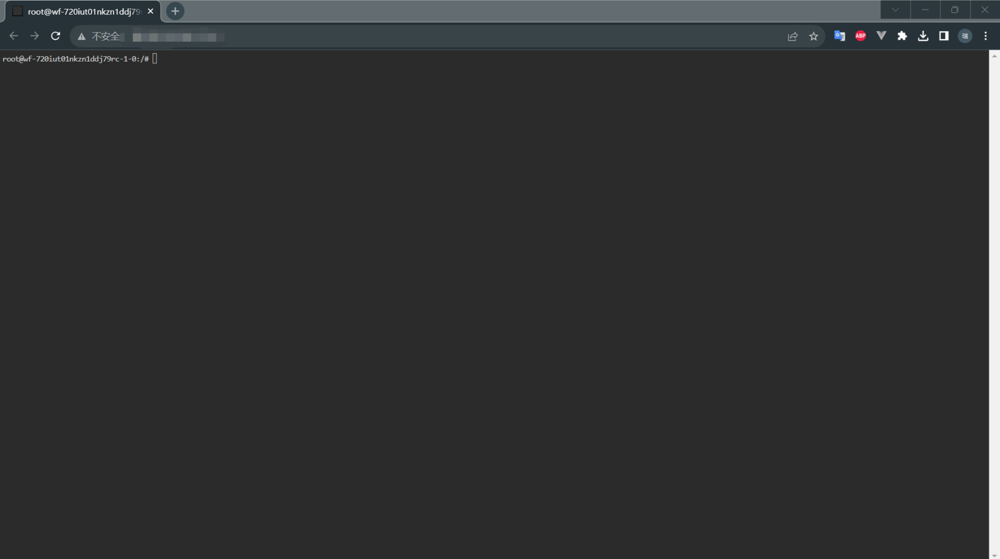

# 2023 秋季系统编程

## 最新消息

- 2023/09/12
  - 增量更新第一章理论作业，该次作业截止时间延长至2023-10-08 23:59:59

- 2023/09/11
  - 课程安排调整

- 2023/09/08
  - 课程内容与安排调整
  - 实验环境联网说明
  - 课程全部PPT更新

- 2023/09/05
    - 在线实验环境需要先安装被精简过的软件包，[这里](https://github.com/buaa-software-system-programmin/lecture-notes/#%E8%BD%AF%E9%99%A2%E4%BA%91%E5%B9%B3%E5%8F%B0)是解决方案。

- 2023/09/04 
    - 第一章理论作业及实验材料已发布。
    - 请大家按照指导书测试(or准备)好实验环境，确保可以完成后续实验。

## 理论作业及与实验方案

系统编程是一门强实践性的课程，我们希望大家通过学习理论 + 实践操作的方式渐进式地理解 Linux 操作系统的基本概念，掌握 Linux 操作系统下的系统编程技术，为后续的操作系统等课程打下坚实的基础。我们的理论作业和实验主要涵盖以下 6 个方面的内容：

- Linux 系统基本操作
- Linux 系统编程工具链基础
- Shell 编程
- 文件操作
- 进程管理
- 进程间通信

为了更好地学习这六个方面的内容，我们将 16 周的课时划分成 4 个单元，每个单元持续 4 周，前 2 周为理论课，后 2 周为实验课，每个单元包含 1 次理论作业与实验作业。

详细的理论作业（Assignment）及实验（Lab）的发布时间如下：

|        时间         |     事件     |           内容           |
| :-----------------: | :----------: | :----------------------: |
|   第一周 ~ 第二周   | Assignment 1 |    Linux 系统基本操作    |
|   第三周 ~ 第四周   |    Lab 1     |    Linux 系统基本操作    |
|   第六周 ~ 第七周   | Assignment 2 | Linux 系统编程工具链基础 |
|   第八周 ~ 第九周   |    Lab 2     | Linux 系统编程工具链基础 |
|  第十周 ~ 第十一周  | Assignment 3 |   Shell 编程、文件操作   |
| 第十二周 ~ 第十三周 |    Lab 3     |   Shell 编程、文件操作   |
| 第十四周 ~ 第十五周 | Assignment 4 |   进程管理、进程间通信   |
|      第十六周       |    Lab 4     |   进程管理、进程间通信   |
| 第十七周 ~ 第十八周 |   期末考试   |         综合考察         |

## 课程平台

课程的理论作业和实验将在 Spoc 平台上发布和提交。同时为了方便没有 Linux 环境的同学，我们在软院云平台上准备了相应的实验环境。所有的理论作业和实验材料也会在 github 上同步发布，方便大家查阅。

Spoc 平台：https://spoc.buaa.edu.cn/

软院云平台：https://scs.buaa.edu.cn/

github仓库：https://github.com/buaa-software-system-programmin/lecture-notes


## 实验环境

为了方便大家进行实验和课程项目，我们在软院云平台上为每一位同学开设了一个基于 Ubuntu 22.04 的 Linux 容器。这个容器将作为在线实验环境，您可以在校园网环境下登录云平台进行实验。

当然，如果你愿意，也可以在本地自行搭建相应的环境进行实验，包括但不限于以下的方式：

1. 你可以使用虚拟机软件（如 VMware Workstation、VirtualBox 等）安装 Ubuntu 22.04 虚拟机。

2. 如果你使用的是 Windows 系统，你可以安装 Windows Subsystem for Linux（WSL2）来进行实验。

3. 你可以购买云服务器（如阿里云、腾讯云、华为云等）进行实验。

### 软院云平台

进入软院云平台，点击在线实验环境实验的详情，


下滑至底部，点击`直接访问`，即可在浏览器中进入实验环境。




:warning:  如果使用云平台提供的在线环境，当你输入某些命令时会出现一段报错：

```bash
root@wf-q4hrqj5hhlrvmgbswwpu-2-0:/# man ls
This system has been minimized by removing packages and content that are not required on a system that users do not log into.
To restore this content, including manpages, you can run the 'unminimize' command. You will still need to ensure the 'man-db' package is installed.
```

这是由于在线实验环境出于节省资源以及加快启动速度的考虑，使用了一个精简版的Linux系统，其中删除了很多不必要的软件包和内容，包括manpages（手册页）。

根据报错信息的提示，我们需要完成两个步骤：

1. **运行 `unminimize` 命令**：

   首先，尝试使用`unminimize`命令恢复内容(这项操作可能需要一段时间)：
   ```bash
   unminimize
   ```

   这个命令会尝试恢复系统上的许多内容，包括manpages。

2. **安装 `man-db` 包**：

   为了能够使用`man`命令，您需要确保已经安装了`man-db`包。您可以使用`apt`包管理器来做这件事：
   ```bash
   apt update
   apt install man-db
   ```

3. **检查 `man` 是否现在可以工作**：

   在安装完`man-db`后，尝试使用`man`命令查看某个命令的手册，例如：
   ```
   man ls
   ```

   如果一切正常，我们应该能够看到`ls`命令的手册页。

> 1. You can [read more about what is Minimal Ubuntu](https://wiki.ubuntu.com/Minimal).
> 
>   Minimal Ubuntu 是一组 Ubuntu 镜像，专为大规模自动化部署而设计，并可在各种云基础上使用。他们在目标计算基板上使用优化的内核和优化的启动过程。这些镜像的默认包集大大减少，没有很多方便交互使用的工具。它们更小，启动速度更快，并且随着时间的推移，需要更少的安全更新，因为它们安装的软件包更少。
> 
> 2. 我们讲解这个例子主要是为了说明一件事情：**<u>机器永远是对的</u>**。如果遇到了错误，请仔细查看报错信息，查阅相关的技术文档（RTFM）、在互联网上进行检索（STFW）或者让AI帮助你找到问题所在（ATFAI）。

### 实验环境联网说明

1. 首先使用 `which buaalogin` 验证是否安装联网程序

   如果成功安装，则会回显可执行文件路径，例如：

   ```
   root@wf-9tolw9ojvru2mptbjwou-1-0:/# which buaalogin
   /usr/local/bin/buaalogin
   ```

   否则需要手动安装，依次执行下列命令

   ```
   sudo wget https://scs.buaa.edu.cn/scsos/tools/linux/buaalogin -O /usr/local/bin/buaalogin
   sudo chmod +x /usr/local/bin/buaalogin
   ```

2. 在确保联网程序安装成功后，配置校园网账号密码

   ```
   buaalogin config
   ```

3. 登陆校园网

   ```
   buaalogin login
   ```

4. 登出校园网

   ```
   buaalogin logout
   ```

   


## 联系信息

- 课程教师: [原仓周]，邮箱: [yuancz@buaa.edu.cn]
- 助教: [扶星辰]，邮箱: [fxcccc@buaa.edu.cn]
- 助教: [黄瑞], 邮箱: [hr.mail.qaq@gmail.com]
