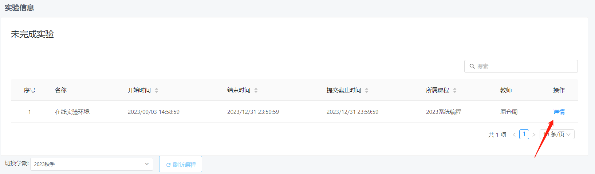
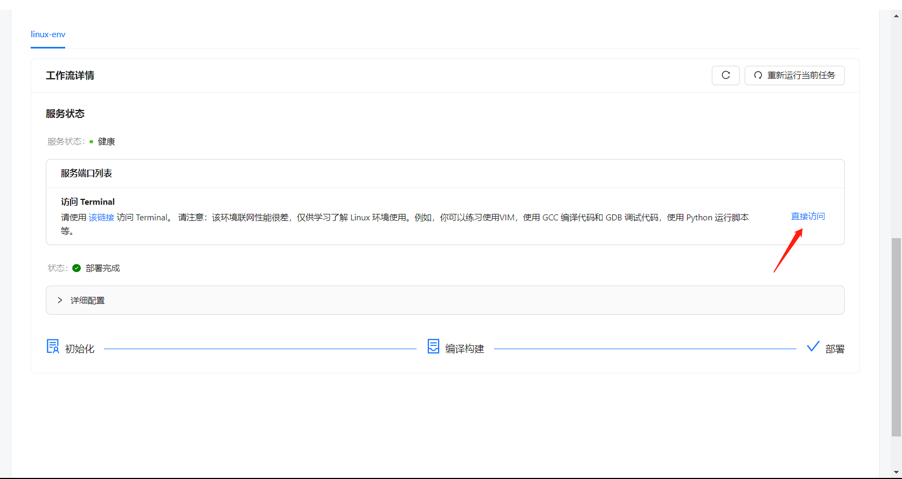

# 2023 秋季系统编程

## 最新消息

## 理论作业及与实验方案

系统编程是一门强实践性的课程，我们希望大家通过学习理论 + 实践操作的方式渐进式地理解 Linux 操作系统的基本概念，掌握 Linux 操作系统下的系统编程技术，为后续的操作系统等课程打下坚实的基础。我们的理论作业和实验主要涵盖以下8个方面的内容：

- Linux 系统基本操作
- Linux 系统编程工具链基础
- Shell 编程
- 文件操作
- 进程管理
- 信号与信号处理
- 进程间通信
- 同步与并发控制

理论作业（Assignment）及实验（Lab）的发布时间如下：

|        时间         |           事件           |
| :-----------------: | :----------------------: |
|   第一周 ~ 第二周   | Assignment1、Assignment2 |
|   第三周 ~ 第四周   |        Lab1、Lab2        |
|   第六周 ~ 第七周   | Assignment3、Assignment4 |
|   第八周 ~ 第九周   |        Lab3、Lab4        |
|  第十周 ~ 第十一周  | Assignment5、Assignment6 |
| 第十二周 ~ 第十三周 |        Lab5、Lab6        |
| 第十四周 ~ 第十五周 | Assignment7、Assignment8 |
|      第十六周       |        Lab7、Lab8        |
|      第十七周       |           考试           |

## 课程平台

课程的理论作业和实验将在 Spoc 平台上发布，同时为了方便没有 Linux 环境的同学，我们在软院云平台上准备了相应的实验环境。所有的理论作业和实验材料也会在 github 上同步发布，方便大家查阅。

Spoc 平台：https://spoc.buaa.edu.cn/

软院云平台：https://scs.buaa.edu.cn/

github仓库：https://github.com/buaa-software-system-programmin/lecture-notes

## 实验环境

为了方便大家进行实验和课程项目，我们在软院云平台上为每一位同学开设了一个基于 Ubuntu 22.04 的 Linux 容器。这个容器将作为在线实验环境，您可以在校园网环境下登录云平台进行实验。

当然，如果你愿意，也可以在本地自行搭建相应的环境进行实验，包括但不限于以下的方式：

1. 你可以使用虚拟机软件（如 VMware Workstation、VirtualBox 等）安装 Ubuntu 22.04 虚拟机。

2. 如果你使用的是 Windows 系统，你可以安装 Windows Subsystem for Linux（WSL2）来进行实验。

3. 你可以购买云服务器（如阿里云、腾讯云、华为云等）进行实验。

### 软院云平台

进入软院云平台，点击在线实验环境实验的详情，

下滑至底部，点击`直接访问`，即可在浏览器中进入实验环境。

## 联系信息

- 课程教师：[原仓周]，邮箱：[yuancz@buaa.edu.cn]
- 助教：[扶星辰]，邮箱：[]
- 助教: [黄瑞], 邮箱: [hr.mail.qaq@gmail.com]
